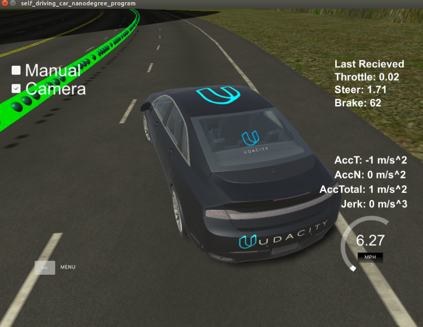

This is the project repo for the final project of the Udacity Self-Driving Car Nanodegree: Programming a Real Self-Driving Car. For more information about the project, see the project introduction [here](https://classroom.udacity.com/nanodegrees/nd013/parts/6047fe34-d93c-4f50-8336-b70ef10cb4b2/modules/e1a23b06-329a-4684-a717-ad476f0d8dff/lessons/462c933d-9f24-42d3-8bdc-a08a5fc866e4/concepts/5ab4b122-83e6-436d-850f-9f4d26627fd9).


### Results

Car will follow the pre-defined waypoint. <br />
Car can hit the thottle from full stop if there is a green light ahead. <br />
Car will follow the pre-defined waypoint.<br />
<br />


### Implementations

#### Traffic light detection by Yolo v3
##### Yolo v3 by darknet ros 


<br />
 Add a darknet_ros node for Yolo v3 traffic_light detection. <br />

	Subscribed Topics
	/camera_reading ([sensor_msgs/Image])

	The camera measurements.

	Published Topics
	object_detector ([std_msgs::Int8])

	Publishes the number of detected objects.

	bounding_boxes ([darknet_ros_msgs::BoundingBoxes])

	Publishes an array of bounding boxes that gives information of the position and size of the bounding box in pixel coordinates.

	detection_image ([sensor_msgs::Image])

	Publishes an image of the detection image including the bounding boxes.
Listen to darknet_ros/bounding_boxes and detection_image topics. save the image when we receive detection_image ros inpiput and classify the traffic light when we receive the bounding boxes ros input with the related save camera image <br />
<br />


<br />
here is the darknet network architecture.
ref from https://arxiv.org/abs/1804.02767
<br />


<br />
 here is saved detected image for traffic light
<br />


<br />
drop the image according to the bounding box, and focus on trafflic light
<br />


<br />
do image proprocessing, and then identify the color of the traffic light
<br />


#### some fine tunes for way point updater and twist controller

<br />
the car may shift when it drives too fast for a larger curve, and then it may hit on some obstacles.
<br />


<br />
##### we apply brake when the steering angle is too big, so the car could recover its path slowly even if it shifts out sometime
<br />





Please use **one** of the two installation options, either native **or** docker installation.

### Native Installation

* Be sure that your workstation is running Ubuntu 16.04 Xenial Xerus or Ubuntu 14.04 Trusty Tahir. [Ubuntu downloads can be found here](https://www.ubuntu.com/download/desktop).
* If using a Virtual Machine to install Ubuntu, use the following configuration as minimum:
  * 2 CPU
  * 2 GB system memory
  * 25 GB of free hard drive space

  The Udacity provided virtual machine has ROS and Dataspeed DBW already installed, so you can skip the next two steps if you are using this.

* Follow these instructions to install ROS
  * [ROS Kinetic](http://wiki.ros.org/kinetic/Installation/Ubuntu) if you have Ubuntu 16.04.
  * [ROS Indigo](http://wiki.ros.org/indigo/Installation/Ubuntu) if you have Ubuntu 14.04.
* [Dataspeed DBW](https://bitbucket.org/DataspeedInc/dbw_mkz_ros)
  * Use this option to install the SDK on a workstation that already has ROS installed: [One Line SDK Install (binary)](https://bitbucket.org/DataspeedInc/dbw_mkz_ros/src/81e63fcc335d7b64139d7482017d6a97b405e250/ROS_SETUP.md?fileviewer=file-view-default)
* Download the [Udacity Simulator](https://github.com/udacity/CarND-Capstone/releases).

### Docker Installation
[Install Docker](https://docs.docker.com/engine/installation/)

Build the docker container
```bash
docker build . -t capstone
```

Run the docker file
```bash
docker run -p 4567:4567 -v $PWD:/capstone -v /tmp/log:/root/.ros/ --rm -it capstone
```

### Port Forwarding
To set up port forwarding, please refer to the [instructions from term 2](https://classroom.udacity.com/nanodegrees/nd013/parts/40f38239-66b6-46ec-ae68-03afd8a601c8/modules/0949fca6-b379-42af-a919-ee50aa304e6a/lessons/f758c44c-5e40-4e01-93b5-1a82aa4e044f/concepts/16cf4a78-4fc7-49e1-8621-3450ca938b77)

### Usage

1. Clone the project repository
```bash
git clone https://github.com/udacity/CarND-Capstone.git
```

2. Install python dependencies
```bash
cd CarND-Capstone
pip install -r requirements.txt
```
3. Make and run styx
```bash
cd ros
catkin_make
source devel/setup.sh
roslaunch launch/styx.launch
```
4. Run the simulator

### Real world testing
1. Download [training bag](https://s3-us-west-1.amazonaws.com/udacity-selfdrivingcar/traffic_light_bag_file.zip) that was recorded on the Udacity self-driving car.
2. Unzip the file
```bash
unzip traffic_light_bag_file.zip
```
3. Play the bag file
```bash
rosbag play -l traffic_light_bag_file/traffic_light_training.bag
```
4. Launch your project in site mode
```bash
cd CarND-Capstone/ros
roslaunch launch/site.launch
```
5. Confirm that traffic light detection works on real life images
